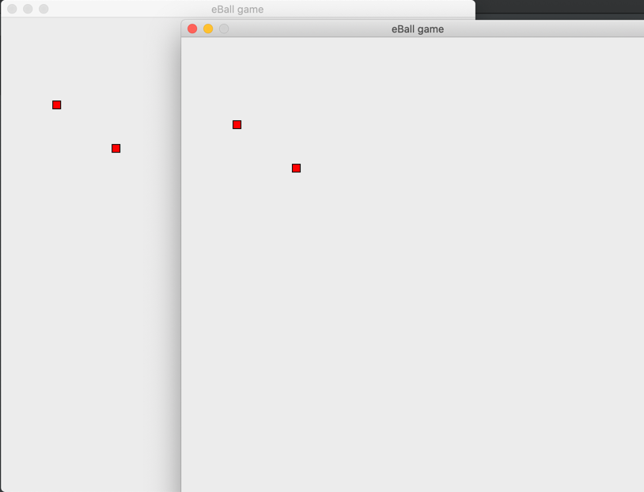

## Simple multiplayer game on python
Inspired by [youtube video](https://www.youtube.com/watch?v=McoDjOCb2Zo&t=2704s&ab_channel=freeCodeCamp.org)

### Technology stack
- tkinter
- socket

To start game locally:
- start server: `python main_server.py`
- start client: `python main_client.py`

Binding keys - 'wasd' and arrow-keys

### 2 clients example
{:height="50%" width="50%"}